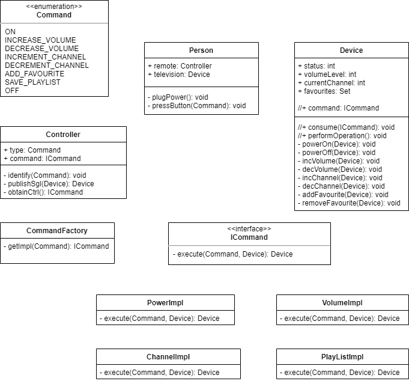
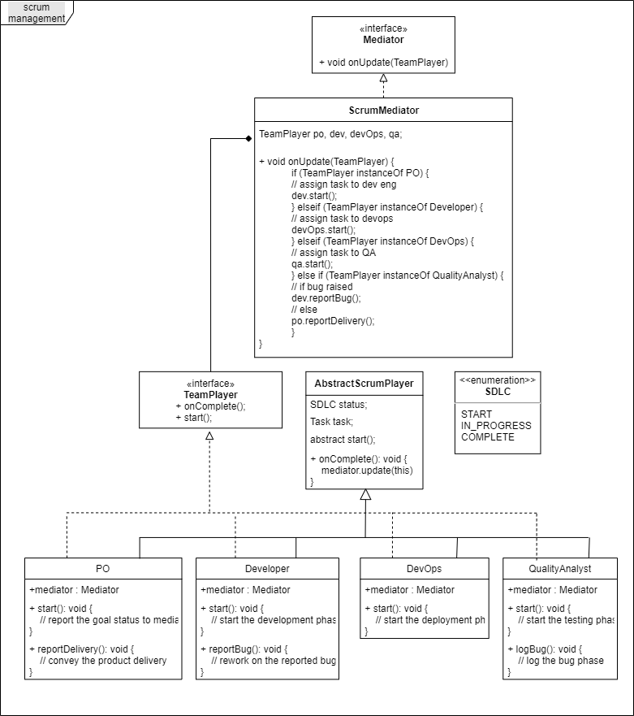

# dzn-pattern
+ [GOF patterns](#gof)
  - Creational
  - Structural
  - Behavioral
    * [Command](#command)
    * [Mediator](#mediator) 
+ J2EE patterns

## GOF

### Creational
### Structural
### Behavioral

#### Command
>_Portray **Person's** interaction with remote-controller._ 
#### Mediator
>_Play around with __Scrum___.

## J2EE
